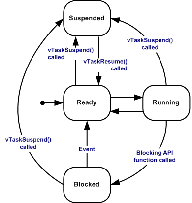
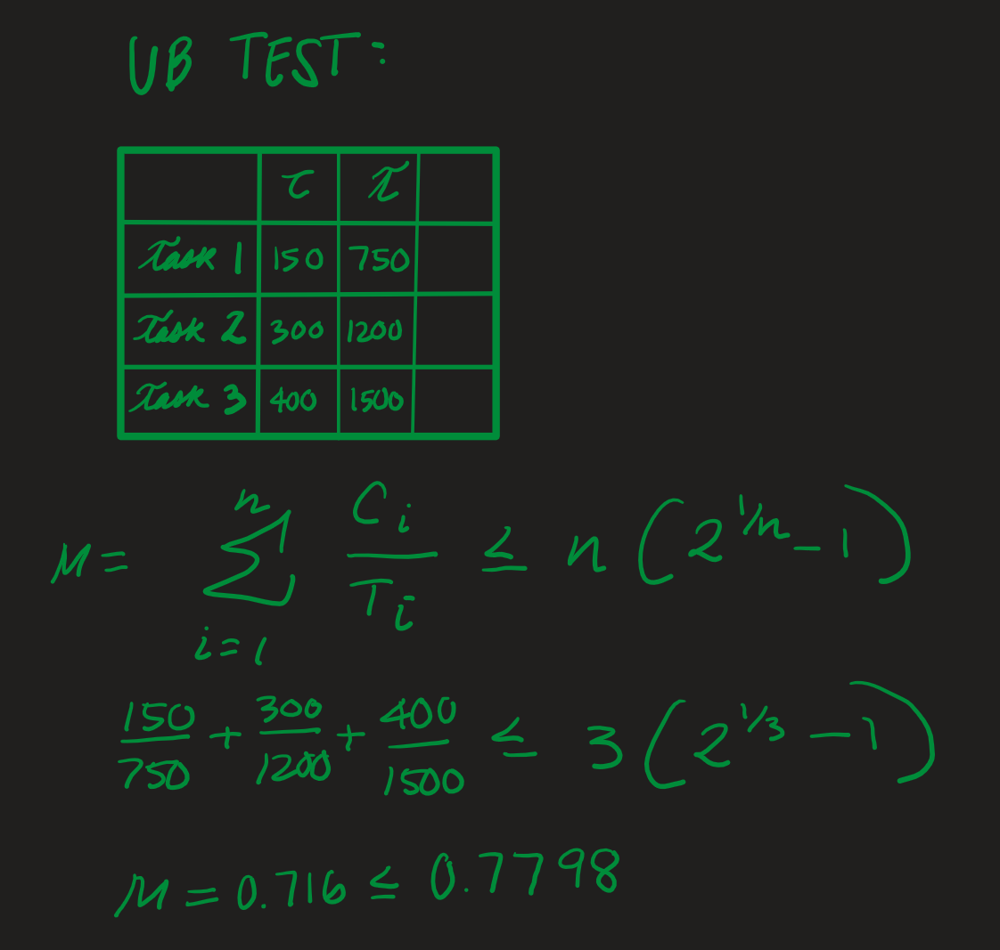

[](https://classroom.github.com/a/d2ClRzof)
# lab5-rtos-skeleton

    * Name: 
    * Github username: 
    * Github Repository URL: 
    * Description of hardware: (embedded hardware, laptop, etc)

## Part A: Introduction to FreeRTOS

### 1. FreeRTOS Documentation Questions

1. Why would an RTOS be required or useful for a system? How is it different from other operating systems?

RTOS is the operating system that is responsible to ensuring that all tasks are executed within some specified timing requirements. This means that if there are multiple tasks running on a single processor, the RTOS will ensure that each activity is completed before the deadline. RTOS is different from other operating systmes in that its main focus is predictability reather than speed; RTOS is not used to minimize the average response time of a set of task.

2. Where is the CPU clock and Tick rate configured? Does a 16MHz tick rate sound reasonable? Why or why not?

The CPU cloack is configured by setting the configUSE_TIMERS to 1, which creates a timer when RTOS starts. The 16MHz tick is configured by setting configUSE_16_BIT_TICKS to 1; this tick rate however, is very high for RTOS applications.

3. Briefly explain the purpose of each of the three main files (tasks.c, queue.c, and list.c).

The tasks.c file uses various configuration parameters to determine which functionalities regarding tasks should be enabled. For example, when configUSE_16_BIT_TICKS is set to 1, then a bit is defined to ensure that that the value of the task priority is not changed. 

The queue.c file defines the type of queue used by the scheduler. 

The list.c file defines the structure of the lists that are used by queue.c and tasks.c.

4. What are the different task states possible? What transitions are possible? (You may attach a diagram).

There are four task states, running, ready, blocked, and suspended. The task states are shown in the diagram below. 



5. Which has a higher priority, a task with priority number “5” or a task with priority number “1”?

A task with priority number "5" has a higher priority.

6. What is the required prototype for all “task” functions and what are the required parameters needed to create a task?

Task Prototype:

```
 void vATaskFunction( void *pvParameters )
    {
        for( ;; )
        {
            -- Task application code here. --
        }

        /* Tasks must not attempt to return from their implementing
        function or otherwise exit.  In newer FreeRTOS port
        attempting to do so will result in an configASSERT() being
        called if it is defined.  If it is necessary for a task to
        exit then have the task call vTaskDelete( NULL ) to ensure
        its exit is clean. */
        vTaskDelete( NULL );
    }
 ```
The input to this function is a void pointer, which is used to pass any type of information about the task.


7. What is the idle task? Is it necessary?

The idle task is responsible for freeing memory allocated by the RTOS that are no longer in used (that have since bween deleted). If applications use the vTaskDelete() function, then the idle task is necessary, however, it can be starved of processing time when an application does not use this functionality.

8. TaskA is ready and has a priority of 0. It can use as much CPU as is available and it is the only task available. What percent of the time would it run?

If TaskA is ready to run, and it is the highest priority task available to run, it will run 100 percent of the time that is needed to complete the task. 

9. What does vTaskDelay() do and how is it different from vTaskSuspend()? From vTaskDelayUntil()?

vTaskDelay() sets a task to a blacked state while vTaskSuspend sets a task to a suspended state. Tasks that are in a blocked state have a "timeout" period, meaning that these tasks will become unblocked even if the event that these tasks are waiting for has not occuered. Tasks that are in a suspended state do not "timeout," meaning that they must be explicity called into and out of the suspended state. 

The vtaskDelayUntil() has a similar functionality to vTaskDelay(), except it specifices the delay period. 

10. What are software timers? Give an example where a software timer would be useful.

A software time allows a function, called the callback function, to be exectued when the timer's period expires. 

A timer may be useful for implementing timeouts - say, timeouts for task delays. Additionally, timers are useful to schedule tasks at regular intervals. 

11. What are some ways that can help prevent stack overflow in FreeRTOS?

In FreeRTOS, each task cooresponds to its own stack. There are two mechanism to aviod stack overflows; both are configured using configCHECK_FOR_STACK_OVERFLOW. When either of these options are implemented, then the application must include a "hook function." This hook function can be called if:

1. The stack pointer contains a value outside the valid stack range.
2. The last 16 bytes within the stack range are not at their initial value.

There is also one other way to check for stack overflows. While this method is only available for specific ports, it is sometimes possible to enable an ISR to to check the stack. In this detecyion method, the hook function is not called. 

12. How does the scheduler “block” tasks and cause them to be removed from the ready list until an event has occurred?

By default, FreeRTOS used a preemtive-based scheduling algorithm, meaning the scheduler will always run the highest priority task that is able to run. However it is also possible to created event driven tasks; these type of tasks require intertask communication and sychronization primitives such as: queues mutesxes, and semaphones, task notifications, stream and message bufferes, and timers.  

13. In the creation of the tasks the usStackDepth is described to be “the number of words (not bytes!) to allocate for use as the task’s stack”. In their example, a 16 bits wide stack with an assigned depth of 100 means 200 bytes will be allocated for use. How did they get 200?

The stack is 16 bits wide, or 2 bytes wide. The stack has a depth of 100, which means that 200 bytes will be allocated for used (since the stack width of one word which is 2 bytes).


### 2. An Example

14. Why would there be a limit on the number of tasks that can be scheduled on a microcontroller?

There would be a limited number of tasks that can be scheduled to not cause a stack overflow. Microcontrolles have limited RAM, and since each tak has its own stack storage, it makes sense to limit the number of tasks that can be scheduled on a microcontroller.  

15. What is the difference between the stack pointer and the program counter?

The stack pointed points to top of the stack, while the the program counter points to the address in memory of the next command to be executed.

16. In your own words, what is the portSAVE_CONTEXT() function and why is it necessary? What would happen if this function wasn’t called?

The portSAVE_CONTEXT() function pushes Task A on the stack and stores a copy of the stack pointer. If this function was not called, the task would be lost when it is interrupted, and RTOS would not be able to switch between tasks effectively.

17. In step 5, why does the stack pointer point to the top of TaskB Stack instead of PC(B) or a lower memory address (e.g. 0x12, 0x34)?

The stack pointer will always point to the top of the stack, and Task B context was saved to the stack when Task B was suspended.

18. What does portRESTORE_CONTEXT() do? Give a more verbose answer than “restore context”.

The portRESTORE_CONTEXT() function restores Task B from its place on the stack to the processor registers (so the program counter can point to Task B code). It also restores the stack point to the task's stack area.

19. After step 7, what if a third task, TaskC, were to interrupt TaskB? TaskC has a higher priority than TaskB. What would the next step look like? You can either write your answer out in words as an explanation and/or draw a diagram.

portSAVE_CONTEXT() would save Task B back on the stack, then the portRESTORE_CONTEXT() function would set Task C to the appropriate register such that the PC points to Task C.

## Part B: Implementation

20. What is the tick rate here? I.e. About every how many seconds does the scheduler throw an interrupt and consider all tasks “ready” to run? FreeRTOSBoardDefs.h may be helpful here.

The tick rate is 7.8125 * 10^-6 seconds. 

21. Why do you think the watchdog timer is used as the scheduler?

Using the watchdog timer as a scheduler is resource efficient, and is much simpler in designed. 

### 1. Task Set

22. Is the task set above RM schedulable? Show your work. Draw out the scheduling diagram. If it is not schedulable, make an adjustment to Task B’s CPU time to make the set RM schedulable.



### 2. RMS - Preemptive

23. Measure the duty cycle of each task. Is it what you expected? If not, why is there a discrepancy? (Hint: It could have something to do with the delayuntil function. There is more than one possible answer here.)

The dudy cycle is about what we expected. However, we used the TaskDelay() function, which is less accurate than the TaskDelayUntil(). This is because measuring differentials in time is generally more accurate than relying soley on timer delays.

24. How does this affect the schedule? Do any tasks miss their deadlines?

Yes, task miss their deadlines. The total utilization no longer passes the UB test because of the increased CPU time of task C.

### 3. RMS - Blocking

25. How does this affect the schedule? Do any tasks miss their deadlines?


## Description of AVR ATmega port of freeRTOS

A port of freeRTOS configured to use the Watchdog Timer on AVR ATmega devices and will operate with almost any classic Arduino device from Arduino, SeeedStudio, Sparkfun, Freetronics or Pololu.

<https://github.com/feilipu/miniAVRfreeRTOS>

## Github Repo Submission Resources

* [ESE5160 Example Repo Submission](https://github.com/ese5160/example-repository-submission)
* [Markdown Guide: Basic Syntax](https://www.markdownguide.org/basic-syntax/)
* [Adobe free video to gif converter](https://www.adobe.com/express/feature/video/convert/video-to-gif)
* [Curated list of example READMEs](https://github.com/matiassingers/awesome-readme)
* [VS Code](https://code.visualstudio.com/) is heavily recommended to develop code and handle Git commits
  * Code formatting and extension recommendation files come with this repository.
  * Ctrl+Shift+V will render the README.md (maybe not the images though)
